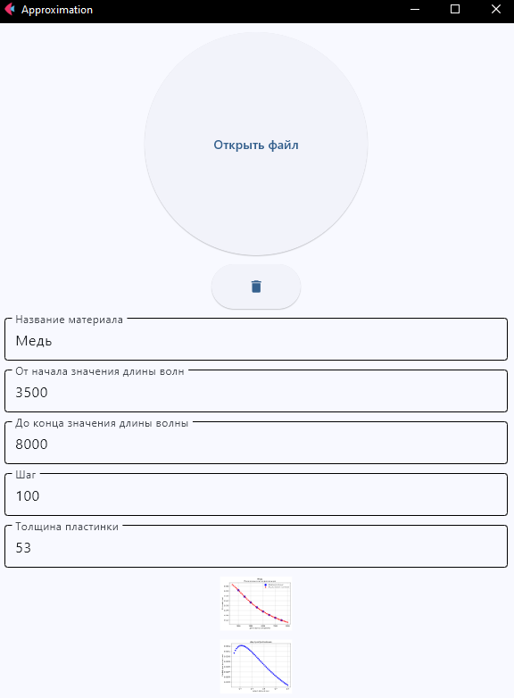

# 
 Виртуальная оптическая дисперсионная аппроксимация Коши 

#### Как использовать:
- Заполните формы:
    - Название материала
    - Диапазон длины волны
    - Шаг с которым будет строиться график
    - Толщина пластины (по умолчанию 0 - график строиться не будет)
- Откройте файл (к примеру file.txt в проекте)  

(Можно построить несколько графиков)

### 
 Главное окно 

### Вид данных для аппроксимации

| #1    | #2    |
| :---: | :---: |
| 4000   | 1,399   |
| 4500   | 1,363   |
| 5000   | 1,327   |
| 5500   | 1,295   |
| 6000   | 1,276   |
| 6500   | 1,257   |
| 7000   | 1,220   |
| 7500   | 1,228   |
